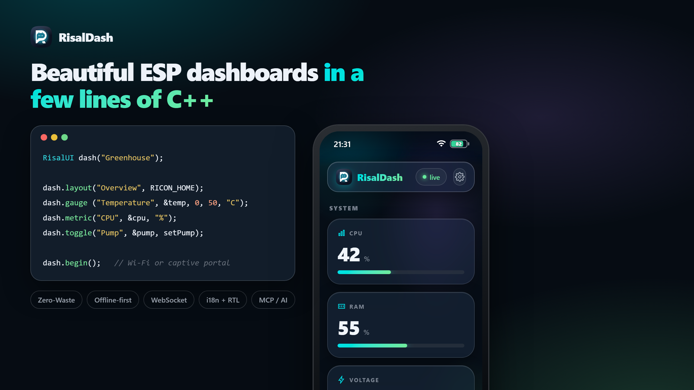

# RisalDash

[](https://github.com/ziyarago/RisalDash/actions/workflows/ci.yml)
[](LICENSE)


**Beautiful real-time web dashboards for ESP32 / ESP8266 — in a few lines of C++.**

<p align="center"></p>

Describe widgets; RisalDash generates the HTML, CSS, JS and the WebSocket protocol for you.
The dashboard is served by the device itself in an **OKLCH "liquid glass"** style (translucent
cards, iOS-like status bar, a Settings gear for language/theme/accent, swipe-up multi-page
layouts), updates live over WebSocket, and works **offline-first** — including a captive portal
for first-boot Wi-Fi setup. Zero front-end code.

🌐 **[dash.risal.io](https://dash.risal.io)** · MIT · ESP32 + ESP8266

```cpp
#include <RisalUI.h>
RisalUI dash("Greenhouse");

float temp = 24.3, volts = 12.1; int bright = 128; bool pump = false;

void setup() {
  dash.gauge ("Voltage", &volts, 0, 14, "V");
  dash.chart ("Temperature", &temp, "C");
  dash.slider("Brightness", &bright, 0, 255, [](int v){ analogWrite(LED_PIN, v); });
  dash.toggle("Pump", &pump, [](bool on){ digitalWrite(PUMP_PIN, on); });
  dash.begin();        // saved Wi-Fi → connect; first boot → captive setup portal
}

void loop() {
  temp = readTemp(); volts = readVolts();
  dash.update();       // pushes changed values to the browser
}
```

## Why RisalDash

- **Zero-Waste UI** — the linker (`--gc-sections`) strips widgets you don't use. Each widget
  type ships its own CSS/JS only when instantiated (~1–1.5 KB each).
- **Offline-first first boot** — `begin()` raises a Wi-Fi access point with a **captive portal**;
  the user picks a network and the credentials are saved to NVS. No internet, no app, no CDN
  (system fonts, everything served from flash).
- **Real-time** — values are pushed over WebSocket only when they change; controls send commands
  back to your callbacks.
- **Widgets for everything** — 26 types: displays, controls, layout (tabs/groups/span), plus
  one-line **sensor presets**.
- **Multi-page + native chrome** — `dash.layout()` splits the UI into pages switched by a
  swipe-up sheet of icon tiles; an iOS-style status bar (clock, Wi-Fi, battery) sits on top.
- **Settings on the device** — a gear in the appbar opens **Language / Theme / Accent**, applied
  live and remembered per browser. `dash.lang("en"|"ru"|"ar")` sets the default; Arabic flips to RTL.
- **Integrations** — REST, Prometheus `/metrics`, optional MQTT, OTA firmware update, and **MCP**
  so an AI agent can read sensors and drive controls (every widget becomes a tool).
- **Brand-consistent** — the same OKLCH design system as the app and [dash.risal.io](https://dash.risal.io).

## Install

**Arduino IDE** — Library Manager → search **"RisalDash"**.

**PlatformIO** — `platformio.ini`:
```ini
lib_deps =
    RisalDash
    esp32async/ESPAsyncWebServer
    esp32async/AsyncTCP        ; ESP32
  ; esp32async/ESPAsyncTCP    ; ESP8266
```

## Wi-Fi: first boot vs. fixed credentials

```cpp
dash.begin();                          // saved creds → STA; otherwise captive setup portal
dash.begin("ssid", "password");        // connect to this network (falls back to the portal)
dash.beginAP("Greenhouse", "12345678");// plain dashboard over its own access point
dash.apName("Greenhouse-Setup");       // name of the captive-portal AP (optional)
```

On first boot the device appears as a `RisalDash-Setup` Wi-Fi. Connect to it — the setup page
opens automatically (captive portal). Pick your network, enter the password; the device reboots
and serves the dashboard on your Wi-Fi.

## Widgets

All widgets bind to a variable by pointer and update live.

| Method | Binds | Notes |
|---|---|---|
| `metric(name, &float, unit)` | `float*` | big number + bar; `.decimals(n)`, `.zone(warn, bad)` |
| `gauge(name, &float, min, max, unit)` | `float*` | circular gauge |
| `chart(name, &float, unit)` | `float*` | live sparkline (30-point history) |
| `stat(name, &float, unit)` | `float*` | read-only number; `.decimals(n)` |
| `progress(name, &int, unit)` | `int*` | 0–100 % bar |
| `badge(name, &int)` | `int*` | 0/1/2 → ok/warn/bad; `.labels(a, b, c)` |
| `led(name, &bool)` | `bool*` | on/off indicator |
| `toggle(name, &bool, cb)` | `bool*` | switch → `cb(bool)` |
| `slider(name, &int, min, max, cb)` | `int*` | range → `cb(int)` |
| `button(name, label, cb)` | — | momentary action → `cb()` |
| `number(name, &int, min, max, step, cb)` | `int*` | stepper |
| `select(name, "a,b,c", &int, cb)` | `int*` | dropdown → index |
| `radio(name, "a,b,c", &int, cb)` | `int*` | segmented → index |
| `text` / `password` / `time` / `color`(name, &String, cb) | `String*` | text & native inputs |
| `date(name, &String, cb)` | `String*` | custom calendar popover (no native input) |
| `label(name, &String)` · `log(name, lines)` | `String*` | read-only text / event log |
| `image(name, &String)` · `ai(name, &String)` | `String*` | image URL / assistant note |
| `table(title).row(label, &float, unit, dec)` | `float*` | key/value rows |

**Layout:** `group(title)`, `separator(title)`, `tab(title)` (switchable panels), and
`.span(2)` / `.span(3)` to widen any card (collapses on mobile).

**Icons:** `.icon(RICON_THERMOMETER)` puts an IoT glyph in the card header. Built-in set:
thermometer, water, flash, bulb, power, gauge, home, wifi, clock, signal, leaf, motion —
or pass any 24×24 SVG path. Only the icons you use are linked into flash.

## Pages, status bar & appearance

Split the dashboard into **pages** — each `dash.layout()` starts one; the widgets after it
belong to that page, and a swipe-up sheet of icon tiles (or the bottom handle) switches pages:

```cpp
dash.layout("Overview", RICON_HOME);
dash.metric("CPU", &cpu, "%");
dash.layout("Climate", RICON_THERMOMETER);
dash.slider("Target", &target, 16, 30);
```

Every page carries an iOS-style **status bar** (clock, Wi-Fi, battery) and an appbar **Settings**
gear (Language / Theme / Accent, remembered per browser). Set the defaults from the sketch:

```cpp
dash.timezone(180);          // status-bar clock & portal default, minutes from UTC (+03:00)
dash.accent(2);              // 0 Aqua · 1 Blue · 2 Violet · 3 Amber · 4 Rose
dash.theme(RisalUI::DARK);   // DARK (default) | LIGHT | AUTO
```

## Sensor presets

One line drops the right widgets, units and ranges for a known sensor:

```cpp
dash.sensor("bme280", &temp, &hum, &pres);  // gauge °C + metric % + chart hPa
dash.sensor("ina219", &volts, &cur, &pwr);  // V / A / W
```

Built-in: `bme280`, `bmp280`, `dht11`, `dht22`, `sht3x`, `ds18b20`, `bh1750`, `ccs811`,
`ina219`, `acs712`, `pzem004t`, `hcsr04`, `vl53l0x`, `mq135`, `soil`, `mpu6050`, `mpu9250`.
The widget is chosen by the **quantity**, not the sensor model.

## Languages

```cpp
dash.lang("ar");   // default: "en" | "ru" | "ar"  — "ar" switches to RTL
```

The appbar **Settings** gear lets the user switch language (EN / RU / AR) live too. Only the
languages you reference are compiled in (Zero-Waste); widget titles stay yours, the library
chrome is translated.

## Integrations & control

```cpp
dash.enableMCP("risal_pat_token");   // GET /api/mcp/manifest → AI tools (see tools/risal-mcp-bridge)
dash.enableOTA();                    // GET/POST /update → firmware update over the air
dash.mqtt("broker.local", 1883, "greenhouse");  // needs -D RISAL_ENABLE_MQTT + PubSubClient
```

| Endpoint | Purpose |
|---|---|
| `GET /api/state` | full state as JSON |
| `GET /api/set?key=value` | set a control |
| `GET /metrics` | Prometheus exposition |
| `GET /api/mcp/manifest?token=` | widgets as MCP tools (token-guarded) |
| `GET/POST /update` | OTA firmware upload (when `enableOTA()`) |

**MCP** — `enableMCP(token)` exposes `GET /api/mcp/manifest`, turning every widget into an AI
tool (read sensors, drive controls). The companion
[**risal-dash-mcp**](https://github.com/ziyarago/risal-dash-mcp) bridge connects a device to
Claude Desktop / Claude Code.

## Examples

- **Minimal** — a few widgets over an access point.
- **FirstBoot** — captive-portal Wi-Fi provisioning (signal levels, timezone), then your network.
- **Layouts** — multi-page dashboard with the swipe-up page switcher + `accent()`/`timezone()`.
- **AllWidgets** — every widget type, grouped by purpose, plus a sensor preset.

## Footprint

Empty web core ≈ the ESPAsyncWebServer stack; each widget type adds ~1–1.5 KB flash. A typical
dashboard (a handful of widgets) is a few KB of RisalDash on top of the web stack.

## Roadmap

Richer charts (multi-series / area / bar), more sensor presets, CSS/JS minify + gzip-in-PROGMEM,
Home Assistant auto-discovery, and a Wokwi simulation link. See [dash.risal.io](https://dash.risal.io).

## License

MIT © Shaxzod Ahmedov. Brand: Risal.
